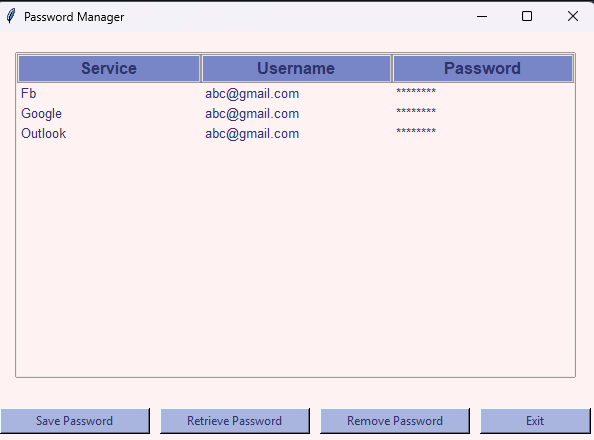
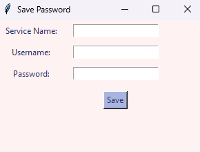
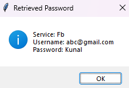
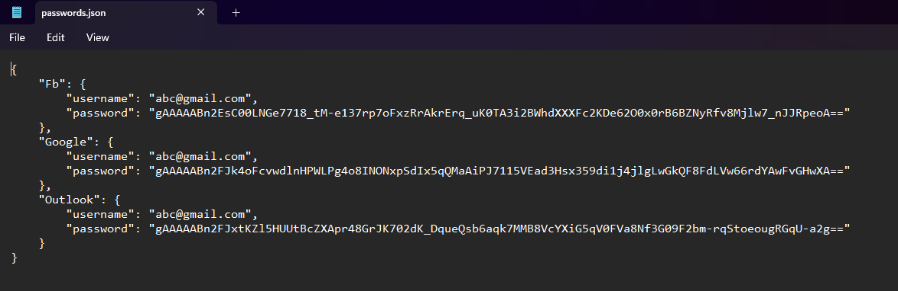

# Password Manager

## Overview
This is a GUI-based Password Manager built using Python and Tkinter. It securely stores passwords using **Fernet encryption** and allows users to save, retrieve, and remove credentials efficiently.

## Features
- 🔐 **Secure Encryption** – Uses **Fernet** encryption to store passwords securely.
- 🖥️ **User-Friendly GUI** – Built with **Tkinter**, offering an intuitive interface.
- 📂 **Password Management** – Easily add, retrieve, and delete stored credentials.
- 🔑 **Master Password** – Ensures security by requiring authentication before retrieving stored passwords.
- 📄 **JSON Storage** – Passwords are stored in an encrypted **JSON** file.

## Screenshots
### Password Manager Screen


### Adding a Password


### Retrieving a Password


### Encrypted JSON Storage


## Installation & Usage
### 1️⃣ Clone the repository
```bash
git clone https://github.com/abnes30/passman.git
cd password-manager
```

### 2️⃣ Install dependencies
```bash
pip install cryptography
```

### 3️⃣ Run the application
```bash
python Pass.py
```

## How It Works
### 🔹 Adding a Password
- Enter the **service name**, **username**, and **password**.
- The password is **encrypted** and saved in `passwords.json`.

### 🔹 Retrieving a Password
- Enter the **master password**.
- Select a service and view the **decrypted credentials**.

### 🔹 Removing a Password
- Select a service and remove it from the list.

## Dependencies
- **Python 3.x**
- **Tkinter** (Included in standard Python)
- **Cryptography (Fernet Encryption)**

## Future Improvements 🚀
- Implement a **stronger master password system**.
- Add **password generation** for stronger credentials.
- Enable **cloud sync for passwords**.

## Contributing 🤝
Feel free to submit issues and pull requests to improve the project.
